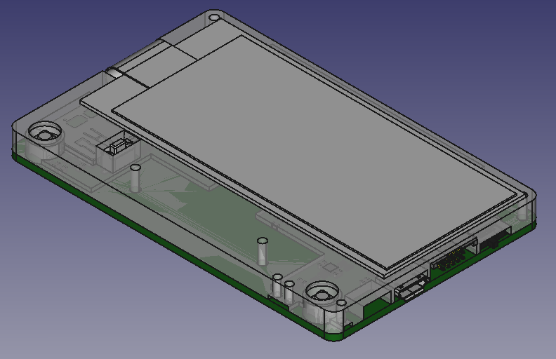

# Snowfox HW Business Card

## PCB

### Top

### Bottom

## Microcontroller

### pin usage

| pin | signal | direction | comment |
|-----|----------|-------------|--------------|
| gpio_0 | LED | output | user led |
| gpio_1 | GPIO_1 | undefined | |
| gpio_2 | SPI_CS_SD | output | chip select SD card |
| gpio_3 | SPI_MOSI | output | |
| gpio_4 | SPI_MISO | input | |
| gpio_5 | SPI_CLK | output | |
| gpio_9 | SPI_CS_DIS | output | chip selecet display |
| gpio_10 | DIS_RESET# | output | display reset |
| gpio_11 | DIS_D_C# | output | display data/command |
| gpio_12 | I2C_SDA | bidir | I2C data |
| gpio_13 | I2C_SCL | output | I2C clock |
| gpio_16 | RX | input | serial rx to USB |
| gpio_17 | TX | output | serial tx to USB |
| gpio_18 | EXT_TX | output | serial tx to expansion connector |
| gpio_19 | DIS_BUSY | input | display busy |
| gpio_20 | NFC_BUSY | input | nfc busy |
| gpio_21 | BUTTON_A | input | button left |
| gpio_22 | BUTTON_B | input | button right |
| gpio_23 | EXT_RX | input | serial rx to expansion connector |

### i2c addresses

| address | device | comment |
|-----|----------|--------------|
| 0x18 | BMA253 | accelerometer |
| 0x53 | M24LR | nfc eeprom |
| 0x60 | ATECC608A | crypto device |

